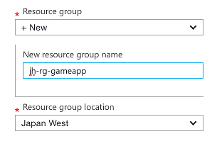
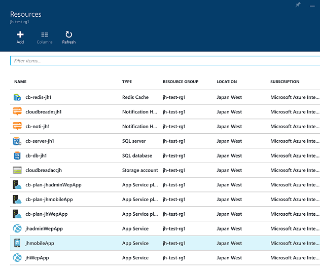

### CloudBread-ARM
This porject is automatic provision script for CloudBread service instances on Cloud.

CloudBread-ARM project is using Microsoft Azure Resource Manager for automatic service deployment.

### Input Parameters info
Input parameter|Detail
---|---|
Resource group|Created new, or used the established resource group.
Resource group name|If you create the resource group, you will input a group name.
Noti namespace|Namespace of notification hubs.
Notification hubs name|Notitfication hubs name for the push alarm.
Server Name|Sql server name for application.
Database Name|RDB name.
Storage Accounts Name|Cheap database for saving log.
Site Name_mobile|mobile app name.
Site Name_adminweb|admin web page name.
Site Name_web|web page name.

### Direction
1.Click the [Deploy to Azure] button.

2.Fill in the blanks about parameter. and Click the [Next>] button

3.Wait for checking the parameters about error, and Click the [Deploy>] button.

4.Wait a minute, and then deployment was completed!
 

#### And then, follow the Continuous Deployment with automation
1.Enter the Azure cloud portal site.

2.In the resource group, find the MobileApp and click it.

3.In the MobileApp, click setting and find Continuous deployment.

4.Choose source what you want.

5.If you select GitHub, you will have to exist the repository.
  select the all of things, and click the [OK] button.

6.Now, Continuous deployment success!

